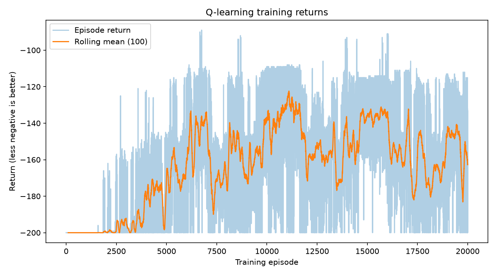
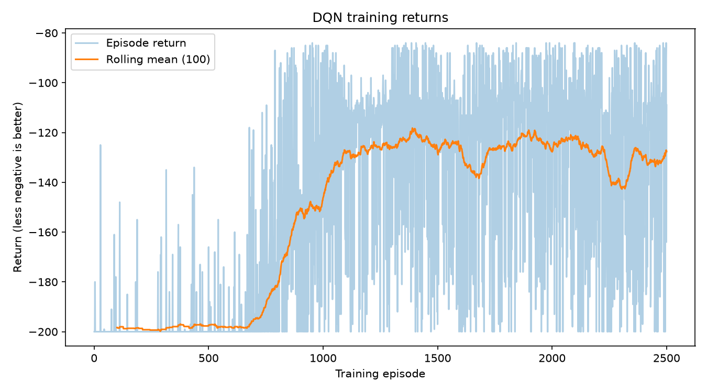

# Actividad 2 — Q-Learning tabular y Deep Q-Network en MountainCar-v0

**Autor:** Alejandro Moncada
**Programa:** Maestría en Inteligencia Artificial
**Curso:** Aprendizaje por Refuerzo y entornos simulados
**Repositorio:** https://github.com/AlejoMoncada/mountain_car

---

## Resumen

Se formularon y resolvieron dos enfoques de Aprendizaje por Refuerzo sobre el entorno `MountainCar-v0`: un agente **Q-Learning tabular** con discretización del espacio de estados y un agente **Deep Q-Network (DQN)** que aproxima la función valor-acción con una red neuronal. Ambos se entrenaron, se evaluaron bajo el mismo protocolo y se compararon con evidencia numérica y gráfica generada por los propios experimentos.

---

## 1. El problema como proceso de decisión

| Elemento | Descripción |
|---|---|
| **Estado** | Posición del carrito (`−1,2` a `0,6`) y velocidad (`−0,07` a `0,07`) |
| **Acciones** | Acelerar a la izquierda, no acelerar, acelerar a la derecha |
| **Recompensa** | `−1` en cada paso |
| **Meta** | Alcanzar la posición `0,5` |
| **Fin del episodio** | Alcanzar la bandera (final real) o agotar 200 pasos (corte por tiempo) |

El motor es demasiado débil para subir la cuesta directamente: el carrito debe mecerse y **acumular impulso con secuencias sostenidas de empujes en la misma dirección**.

Como toda recompensa es `−1`, **el retorno es el negativo del número de pasos**: menos negativo es mejor. Esto explica la dificultad central del entorno: hasta que se alcanza la bandera una sola vez, **todas las transiciones tienen la misma recompensa**, así que no hay señal que distinga una buena acción de una mala.

---

## 2. Esquema del entrenamiento de Q-Learning

> **Dibujo propio del ciclo de entrenamiento.**


**Explicación del ciclo:** el agente observa posición y velocidad, **discretiza** esas dos medidas en una casilla de la tabla, **elige una acción** con ε-greedy (explorar al azar o explotar el mayor Q), **ejecuta** la acción en el entorno, recibe una **recompensa de −1** junto con el nuevo estado, y **actualiza Q(s,a)** con su regla de aprendizaje. Si el episodio no terminó, el nuevo estado pasa a ser el actual y el ciclo se repite.

$$\underbrace{Q(s,a)}_{\text{estimación actual}} \leftarrow \underbrace{Q(s,a)}_{\text{lo que ya sabía}} + \underbrace{\alpha}_{\text{cuánto aprende}}\Big[\underbrace{r + \gamma \max_{a'} Q(s',a')}_{\text{objetivo de Bellman}} - Q(s,a)\Big]$$

---

## 3. Esquema del entrenamiento de DQN

> **Dibujo propio del ciclo de entrenamiento.**


**Explicación del ciclo:** la tabla se reemplaza por una **red neuronal (θ)** que recibe el estado y devuelve un valor por acción. Cada transición `(s, a, r, s′, terminado)` se guarda en un **buffer de experiencias**. En cada paso se **muestrea un lote** al azar, se calcula el **objetivo** con una **copia congelada de la red (θ⁻)** que se sincroniza cada N pasos, se mide el **error de Bellman** y se **actualiza θ** con un paso de gradiente.

**Punto clave del ejercicio 3:** la exploración de DQN debe **mantener la misma acción durante varios pasos seguidos**. La exploración que sorteaba una acción nueva en cada paso hacía imposible producir las secuencias sostenidas que el entorno exige, y el agente nunca alcanzaba la bandera. Este hallazgo se midió antes de corregirlo (sección 4.3).

---

## 4. Entrenamiento y resultados

### 4.1 Q-Learning tabular

**Hiperparámetros:** discretización de `20 × 20` casillas (400 estados), `α = 0,1`, `γ = 0,99`, `ε` de `1,0` a `0,01` con decaimiento `0,9995` por episodio.

**Protocolo:** 20.000 episodios de entrenamiento (semilla `20250308`) y 100 episodios de evaluación **voraz, sin exploración**, con semillas distintas a las del entrenamiento (`30250308`…`30250407`). Duración: **35,5 segundos**.

**Resultado obtenido:**

| Métrica | Valor |
|---|---|
| Retorno promedio en evaluación | **−166,88** |
| Desviación estándar | 23,11 |
| Episodios que alcanzaron la bandera | **84 de 100** |
| Mejor retorno en evaluación | **−128** |

**Evidencia:**



**Comentario:** durante los primeros episodios el retorno se mantiene en `−200`, señal de que el agente aún no encuentra la bandera. Después comienza a mejorar de forma sostenida hasta estabilizarse. En la evaluación final, **84 de cada 100 intentos llegan a la meta** y el mejor episodio alcanzó **−128** (128 pasos). El mejor retorno visto durante el *entrenamiento* fue `−89`, pero se logró **explorando**, por lo que no representa la calidad de la política final.

### 4.2 DQN

**Hiperparámetros:** red de `2 → 128 → 128 → 3` con ReLU, `α = 0,001` (Adam), `γ = 0,99`, lote de 64, buffer de 100.000 transiciones, sincronización de la red objetivo cada 10 episodios, `ε` de `1,0` a `0,01` con decaimiento `0,995`, `explore_run_length = 20`.

**Protocolo:** 2.500 episodios de entrenamiento (semilla `20250310`) y 100 episodios de evaluación voraz con semillas disjuntas (`30250310`…`30250409`). Duración: **3 minutos 40 segundos**.

**Resultado obtenido:**

| Métrica | Valor |
|---|---|
| Retorno promedio en evaluación | **−112,34** |
| Desviación estándar | 31,74 |
| Episodios que alcanzaron la bandera | **89 de 100** |
| Mejor retorno en evaluación | **−84** |

**Evidencia:**



**Comentario:** el DQN alcanza una política claramente mejor que el agente tabular: **−112,34 de promedio y 89% de éxito**, con un mejor episodio de **−84** (84 pasos). Durante el entrenamiento su curva es más ruidosa, comportamiento esperado porque la red objetivo y el muestreo de lotes introducen variabilidad.

### 4.3 Medición del problema de exploración (ejercicio 3)

Antes de corregir la exploración se midió qué logra un agente de acciones completamente aleatorias, en 500 episodios con semilla fija:

| Métrica | Valor medido |
|---|---|
| Episodios que alcanzaron la bandera | **0 de 500** |
| Episodios cortados por los 200 pasos | 500 |
| Retorno promedio | `−200,0` |
| Mejor posición alcanzada | `−0,168` (la meta es `0,5`) |
| Racha más larga con la misma acción | 11 pasos |

**Diagnóstico:** el azar uniforme genera secuencias demasiado cortas para acumular impulso. La probabilidad de repetir la misma acción 20 veces con tres acciones posibles es de aproximadamente `3 × 10⁻¹⁰`. Por eso el agente **nunca presenciaba un episodio exitoso** y no tenía de dónde aprender.

**Corrección aplicada:** al explorar, el agente elige una acción y **la mantiene durante una racha de entre 1 y 20 pasos**, con lo cual sí puede producir el movimiento de bombeo. La regla de aprendizaje, la recompensa y la evaluación voraz **no se modificaron**. Tras el cambio, el entrenamiento pasó de una puntuación plana de `−200` a alcanzar la bandera decenas de veces.

---

## 5. Comparación de los dos métodos

| Criterio | Q-Learning tabular | DQN |
|---|---|---|
| Episodios de entrenamiento | 20.000 | **2.500** |
| Tiempo de entrenamiento | **35,5 s** | 3 m 40 s |
| Retorno promedio en evaluación | −166,88 | **−112,34** |
| Episodios exitosos | 84 / 100 | **89 / 100** |
| Mejor retorno | −128 | **−84** |
| Estabilidad durante el entrenamiento | **Más estable** (DE 29,0) | Más ruidoso (DE 42,6) |
| Dispersión en la evaluación | **Menor** (DE 23,1) | Mayor (DE 31,7) |
| Dificultad de implementación | Baja | Alta |
| Interpretabilidad | **Alta** (se lee la tabla) | Baja |
| Generalización entre estados | No | **Sí** |

### ¿Por qué el DQN obtiene mejor resultado?

1. **Aprovecha mejor cada experiencia.** La tabla aprende casilla por casilla y no transfiere nada a las vecinas; la red generaliza, así que una transición mejora también estados parecidos.
2. **No pierde precisión al discretizar.** La grilla de `20 × 20` mezcla posiciones y velocidades distintas dentro de la misma casilla; el DQN trabaja con los valores continuos.
3. **Llega a una mejor política final**, medida con la misma evaluación voraz de 100 episodios.

**El DQN no gana en todo:** fue **seis veces más lento** en tiempo real, su entrenamiento fue más ruidoso y necesitó una corrección de exploración para funcionar. El agente tabular, en cambio, es simple, rápido, estable y fácil de explicar.

---

## 6. Conclusiones

1. **Ambos métodos resuelven parcialmente el problema.** El DQN llega a `−112,34` con 89% de éxito y roza el umbral de `−110`; el Q-Learning tabular se queda en `−166,88` con 84%.
2. **La diferencia principal está en la eficiencia de las muestras, no en el tiempo.** El DQN necesitó ocho veces menos episodios, pero seis veces más tiempo de cómputo.
3. **El hallazgo más importante fue la exploración.** En un entorno donde la única recompensa es `−1` por paso y el éxito exige secuencias sostenidas, una política que sortea una acción nueva en cada paso **nunca alcanza la meta** (medido: 0 de 500 episodios). Sin esa corrección, el DQN aprendía correctamente… que nada de lo que hacía importaba.
4. **Medir antes de corregir evitó una solución a ciegas.** El diagnóstico numérico explicó el `−200` constante de la curva plana.
5. **Existen limitaciones que se declaran honestamente:** se usó una sola semilla por agente, los presupuestos de episodios no fueron iguales, no se hizo barrido de hiperparámetros, y 11 de cada 100 episodios del DQN aún agotan los 200 pasos.

---

## 7. Cómo reproducir los resultados

```bash
# 1. Preparar el entorno (Python 3.11)
uv sync

# 2. Ejecutar las pruebas
uv run python -m unittest discover -s tests -p 'test_*.py' -v

# 3. Entrenar y evaluar Q-Learning (≈35 s)
uv run python scripts/run_qlearning_experiment.py \
  --episodes 20000 --seed 20250308 \
  --eval-seed 30250308 --eval-episodes 100 \
  --output-dir artifacts/qlearning/seed-20250308 \
  --save-path saves/qlearning_seed-20250308.pkl

# 4. Medir el problema de exploración
uv run python scripts/measure_random_exploration.py

# 5. Entrenar y evaluar DQN (≈4 min)
uv run python scripts/run_dqn_experiment.py \
  --episodes 2500 --seed 20250310 \
  --eval-seed 30250310 --eval-episodes 100 \
  --output-dir artifacts/dqn/seed-20250310 \
  --save-path saves/dqn_seed-20250310.pt
```

Cada ejecución produce `training_episodes.csv`, `evaluation_episodes.csv`, `summary.json` y `training_curve.png` en su carpeta de artefactos. Los experimentos rechazan sobrescribir resultados existentes y usan semillas disjuntas para entrenamiento y evaluación.

---

## 8. Trabajo realizado y evidencias en el repositorio

| Contenido | Ubicación |
|---|---|
| Agente Q-Learning tabular | `src/mountain_car/agents/qlearning.py` |
| Agente DQN | `src/mountain_car/agents/dqn.py` |
| Pruebas automatizadas (23) | `tests/` |
| Guía conceptual de Q-Learning | `docs/qlearning-foundations.md` |
| Guía conceptual de DQN | `docs/dqn-foundations.md` |
| Diagnóstico de exploración | `docs/dqn-exploration-diagnosis.md` |
| Comparación documentada | `docs/comparacion-qlearning-dqn.md` |
| Evidencia Q-Learning | `artifacts/qlearning/seed-20250308/` |
| Evidencia DQN | `artifacts/dqn/seed-20250310/` |
| Evidencia de exploración aleatoria | `artifacts/dqn/random-exploration/seed-20250310/` |

El desarrollo se registró con commits descriptivos en la rama `feat/qlearning-foundations` del repositorio.
